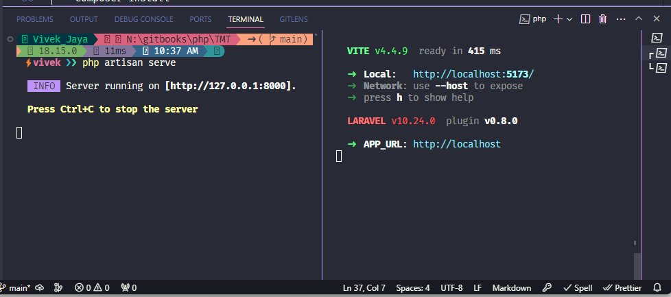
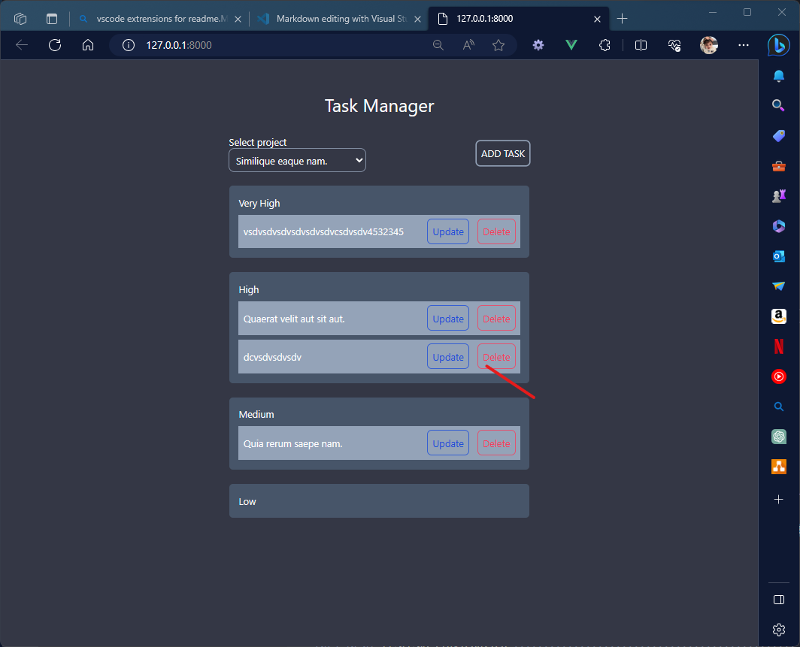

# Tech stack used

1.  Backend
    1.  PHP - 8.1
    2.  MySql - 8.0
    3.  Laravel - 10.0
2.  Frontend
    1.  Inertia - 1.0
    2.  Vue - 3
    3.  npm - 9.5.0
    4.  node - 18.15.0

# Installation Guide

### If you are receiving code base from me directly in zip file.

step 1. Just make sure your dev environment has versions installed for frontend as well backend. you do not need to any composer or npm packages installation in project root.

step 2. Make sure you .env has correct credentials for db connection.

<pre>
DB_CONNECTION=mysql
DB_HOST=127.0.0.1
DB_PORT=3306
DB_DATABASE=db_name
DB_USERNAME=user_name
DB_PASSWORD=password

</pre>

step 3. Run <b>Migrations and Seeders</b> for initial data

 <pre>
     php artisan migrate --seed
 </pre>

step 4. Open two different terminal and run code below in different terminal

 <pre>
    php artisan serve  
 </pre>

and

 <pre>
    npm run dev
 </pre>

### Note. I did not used docker because was not sure if it requires in this task or not.

### If you are pulling for GITHUB.

step 1. install composer and node packages first run commends below one by one

 <pre>
     composer install
 
     npm install
 </pre>

step 2. follow step 2 to step 4 above to run project
 
 

## Task Check list [Total Time - 2 hour 58 Minutes ]

### 1. Create, edit, delete task (info to save: task name, priority, timestamps)

#### Finish time - 42 Mins[Start Time: Sept-30- 2:00 PM End Time 2:42 PM]

### 2. Reorder tasks with drag and drop in the browser. Priority should automatically be updated based on this. #1 priority goes at top, #2 next down and so on.

#### Finish time - [Start Time: Sept-30- 2:45 PM End Time 3:36 PM] - 49 Mins

### 3. Tasks should be saved to a mysql table.

#### Finish time -[finished with task 1]

### 4. BONUS POINT: add project functionality to the tasks. User should be able to select a project from a dropdown and only view tasks associated with that project.

#### Finish time - [Start Time: Sept-30- 3:45 PM End Time 5:12 PM] - 1 hour 27 minutes

 
 

# Screen shots

1. List all tasks on project selection priority wise
   

2. Add task with validation
   

3. Update task with validations reused form component from add task
   

4. Delete task
   
